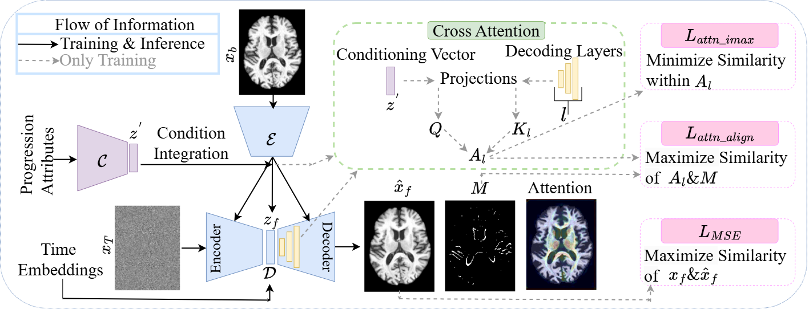

# Align-cDAE: Attention-Aligned Conditional Diffusion Auto-encoder for Alzheimer's Disease Progression

## Architecture


> Figure: High-level schematic of the Align-cDAE framework.

## Inference
- Demo is provided: **`Inference_Align_cDAE.ipynb`**  

## Training
- Training script: **`training_.py`**

  
## Installations
### 🐳 Docker Base Image

This project is built on top of the MONAI Toolkit images:

```dockerfile
FROM nvcr.io/nvidia/clara/monai-toolkit:2.2
```


## 🧠 Dataset

We utilize **longitudinal brain MRI scans** from the following publicly available repository:

- **Alzheimer’s Disease Neuroimaging Initiative (ADNI)**  
  [https://adni.loni.usc.edu/](https://adni.loni.usc.edu/)  
  Subjects include three cognitive statuses: *Cognitively Normal (CN)*, *Mild Cognitive Impairment (MCI)*, and *Alzheimer’s Disease (AD)*.

All selected images are **T1-weighted 3D structural MRIs**.


